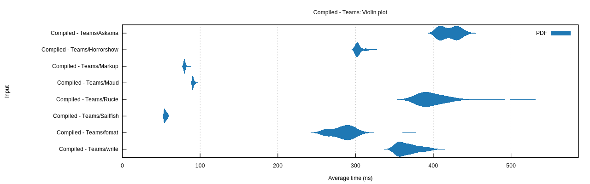

# Rust template engine benchmarks

This repo tries to assess Rust template engine performance. Templating engines are grouped into two broad categories:

## Compiled Templates

> Compiled templating engines use macros, `build.rs`, or similar mechanisms to generate optimized rust code for rendering the template. These engines require you to rebuild when a template changes.

- [write!][write]: the std library `write!` macro
- [Askama][askama]: type-safe, compiled Jinja-like templates for Rust
- [horrorshow][horrorshow]: a templating library written in rust macros
- [ructe][ructe]: Rust Compiled Templates, efficient type-safe web page templates
- [fomat][fomat]: alternative syntax for print/write/format-like macros with a small templating language
- [markup][markup]: A blazing fast, type-safe template engine for Rust.
- [maud][maud]: A Compile-time HTML template engine for Rust.
- [sailfish][sailfish]: Simple, small, and extremely fast template engine for Rust

## Runtime Templates

> Runtime templating engines typically have custom lexers/parsers and interpret the template at runtime. While typically slower than the compiled variants, they offer other advantages such as not requiring a rebuild of your rust codebase when a template changes.

- [Handlebars][handlebars]: Handlebars templating implemented in Rust
- [Tera][tera]: template engine based on Jinja2/Django templates
- [Liquid][liquid]: the liquid templating language for Rust
- [minijinja][minijinja]: A powerful template engine for Rust with minimal dependencies.
- [ramhorns][ramhorns]: Fast Mustache template engine implementation in pure Rust.

[crates]: https://crates.io/categories/template-engine
[write]: https://doc.rust-lang.org/std/macro.write.html
[handlebars]: https://github.com/sunng87/handlebars-rust
[tera]: https://github.com/Keats/tera
[liquid]: https://github.com/cobalt-org/liquid-rust
[askama]: https://github.com/djc/askama
[ructe]: https://github.com/kaj/ructe
[horrorshow]: https://github.com/Stebalien/horrorshow-rs
[fomat]: https://github.com/krdln/fomat-macros
[markup]: https://github.com/utkarshkukreti/markup.rs
[sailfish]: https://github.com/Kogia-sima/sailfish
[maud]: https://github.com/lambda-fairy/maud
[minijinja]: https://github.com/mitsuhiko/minijinja
[ramhorns]: https://github.com/maciejhirsz/ramhorns

## Results

[Violin plots] and numbers, generated by [Criterion]:

[violin plots]: https://en.wikipedia.org/wiki/Violin_plot
[criterion]: https://japaric.github.io/criterion.rs/

### AMD Ryzen 7 5850U - 2023-02-08 (rustc 1.67.0)

### Compiled




```
Big Table/Askama      time: [300.09 µs 301.08 µs 302.49 µs]
Big Table/fomat       time: [194.72 µs 196.65 µs 198.75 µs]
Big Table/Horrorshow  time: [166.87 µs 167.38 µs 167.99 µs]
Big Table/Markup      time: [44.955 µs 44.980 µs 45.006 µs]
Big Table/Maud        time: [53.340 µs 53.402 µs 53.473 µs]
Big Table/Ructe       time: [219.15 µs 219.42 µs 219.78 µs]
Big Table/Sailfish    time: [25.111 µs 25.120 µs 25.128 µs]
Big Table/write       time: [224.40 µs 224.42 µs 224.44 µs]

Teams/Askama          time: [421.43 ns 423.21 ns 425.37 ns]
Teams/fomat           time: [258.26 ns 258.67 ns 259.03 ns]
Teams/Horrorshow      time: [336.44 ns 336.73 ns 337.02 ns]
Teams/Markup          time: [75.661 ns 75.776 ns 75.894 ns]
Teams/Maud            time: [105.82 ns 106.14 ns 106.51 ns]
Teams/Ructe           time: [401.69 ns 401.92 ns 402.17 ns]
Teams/Sailfish        time: [52.360 ns 52.457 ns 52.581 ns]
Teams/write           time: [333.68 ns 335.51 ns 337.31 ns]
```

### Runtime


```
Big Table/Handlebars  time: [2.6925 ms 2.6956 ms 2.6988 ms]
Big Table/Liquid      time: [3.8958 ms 3.8982 ms 3.9009 ms]
Big Table/Minijinja   time: [989.33 µs 989.94 µs 990.53 µs]
Big Table/Mustache    time: [370.46 µs 371.77 µs 372.77 µs]
Big Table/Ramhorns    time: [220.90 µs 221.05 µs 221.23 µs]
Big Table/Tera        time: [1.1439 ms 1.1450 ms 1.1462 ms]

Teams/Handlebars      time: [3.0111 µs 3.0258 µs 3.0410 µs]
Teams/Liquid          time: [4.4515 µs 4.4624 µs 4.4760 µs]
Teams/Minijinja       time: [1.9768 µs 1.9782 µs 1.9797 µs]
Teams/Mustache        time: [846.21 ns 853.09 ns 860.14 ns]
Teams/Ramhorns        time: [265.00 ns 265.12 ns 265.25 ns]
Teams/Tera            time: [3.1173 µs 3.1245 µs 3.1322 µs]
```

## Running the benchmarks

```bash
$ cargo bench
```

Plots will be rendered if `gnuplot` is installed and will be available in the `target/criterion` folder.
